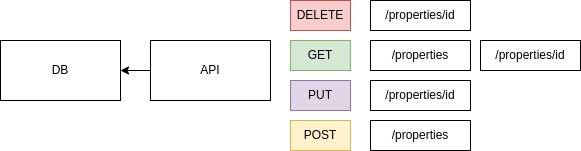
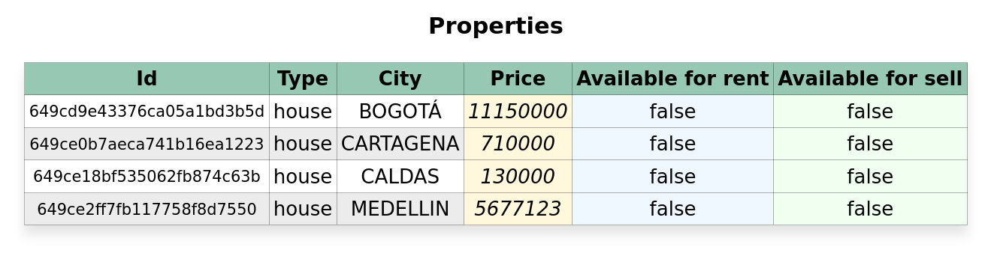
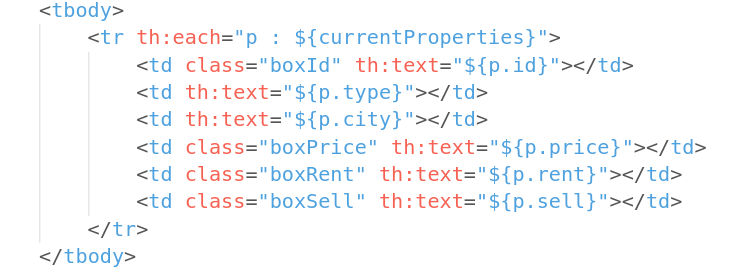
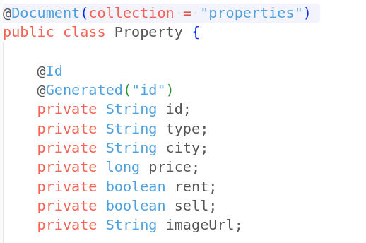
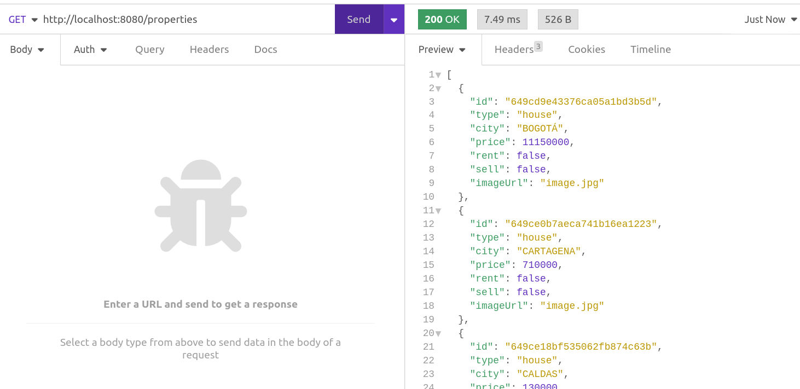
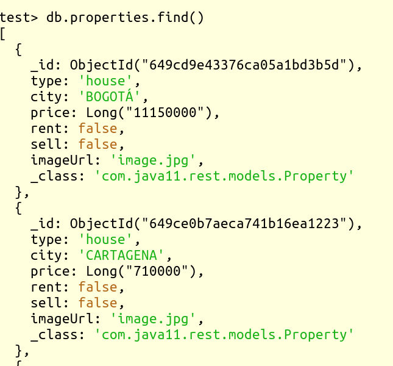

# spring_rest
Spring REST service

Change Java and/or Spring version using sdkman
```
sdk use java 11
sdk use spring 2.7.13
```
The database name used is "test", in MongoDB

The entity is Property with these parameters
```
private String id;
private String type;
private String city;
private long price;    
private boolean rent;
private boolean sell;
private String imageUrl;
```

Structure


View using Thymeleaf


View Using Thymeleaf


Entity


Example request


Database

